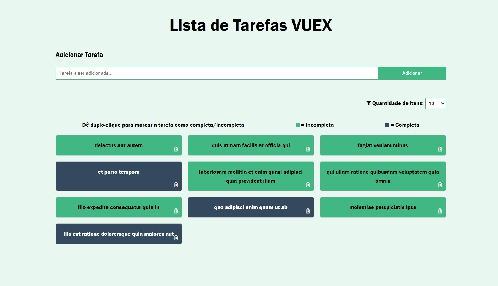

<h1 align="center">
  :books: Simple CRUD with Vuex
</h1>

<p align="center">
  <a href="#trophy-lessons-learned">Lessons Learned</a>&nbsp;&nbsp;&nbsp;|&nbsp;&nbsp;&nbsp;
  <a href="#rocket-technologies--resources">Technologies</a>&nbsp;&nbsp;&nbsp;|&nbsp;&nbsp;&nbsp;
  <a href="#hammer-setting-up-the-environment">Environment Setup</a>&nbsp;&nbsp;&nbsp;|&nbsp;&nbsp;&nbsp;
  <a href="#zap-features">Features</a>
</p>

<p align="center">
  

  

  

  

  
</p>

<p align="center">
  
</p>

CRUD application developed to learn the official Vue.js state manager, Vuex. Completely based on Traversy Media's [crash course available in YouTube](https://www.youtube.com/watch?v=5lVQgZzLMHc).

[Check out the application running!](https://juliolmuller.github.io/studying-vuex-crud/)

## :trophy: Lessons Learned

- Vuex (official Vue's state manager)
- `async`/`await` syntax :heart_eyes:
- Upgrading to Vuex 4;
- Using `<suspense>` component to handle asynchrony

## :rocket: Technologies & Resources

**Frontend:**
- Vue.js ~~v2~~ v3
- Vuex ~~v3~~ v4
- Axios (HTTP client)

**Development:**
- Visual Studio Code
- ~~Vue CLI~~Vite & Node.js routines

## :hammer: Setting up the Environment

Make sure to have **Node.js 10+** installed in your machine and its **npm** available in the command line, then use the following routines:

```bash
$ npm install     # Download dependencies
$ npm start       # Run development server
$ npm run build   # Build files for production
```

## :zap: Features

- [x] Fetch tasks from [JSON Placeholder REST API](https://jsonplaceholder.typicode.com/);
- [x] Create new task;
- [x] Complete existing task;
- [x] Delete existing task;
- [x] Change quantity of items being displayed;
- [ ] Re-implement using TypeScript
